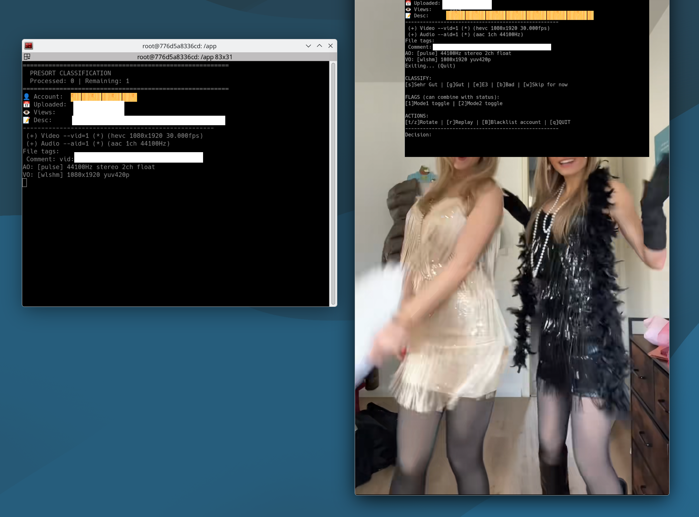

# 🎥 Natural Grounding TikTok Video Manager


## 🌿 Background

Natural Grounding is a practice by Rion Williams (2007) - the idea is simple: immersive, repeated viewing of women with authentic, uninhibited feminine energy recalibrates your attraction baseline away from the manufactured Western standard.

### 🧘 How it works

You sit down, put on a playlist of curated videos, and just watch - relaxed, no agenda. No analysis, no overthinking. You let the energy of naturally feminine women sink in. Over time this builds a real internal reference point for what genuine femininity looks and feels like, which most Western men have never had. The result is that you feel better, more grounded, less reactive to social games - and women notice.

Williams originally used Thai pop VCDs for this. **TikTok is the modern equivalent** - millions of short clips, many from East and Southeast Asian creators, where that same unfiltered natural energy still surfaces constantly. The challenge is finding and curating it efficiently. That's what this tool does.

### 📊 Content Categories

Williams rated his resources with a simple system: `N` for natural energy, `SB` for Silver Bullet (highest impact), and `E` for Entertainment - enjoyable but mixed energy, not pure grounding material.

This project maps that to TikTok. The **E3** classification directly corresponds to Williams' E3 the vault high energy state numen enlightment resonanz trigger.

---

## ⚙️ What It Does

- 📥 **Download** TikTok videos from curated accounts via `yt-dlp`
- 🎬 **Classify** each video interactively with `mpv`
- 📋 **Build playlists** with configurable filters
- 🗄️ **Track metadata** per video (views, date, resolution, usage count)
- 👤 **Manage accounts** (activate, blacklist, bulk import)

---

## 🏷️ Video Classification

| Status | Meaning |
|--------|---------|
| `pending` | Not yet classified |
| `sehr_gut` | 🌟 Strong natural energy - primary grounding material |
| `gut` | ✅ Good natural energy |
| `e3` | 🎭 Entertainment tier - enjoyable, mixed energy |
| `unbrauchbar` | ❌ Rejected |

---

## 🚀 Setup

### Bare Metal
```bash
cp config/db_config.env.example config/db_config.env
nano config/db_config.env
./init.sh
```

### 🐳 Podman + Quadlet (systemd)
```bash
# Build image
podman build -f DOCKERFILE -t localhost/mariadb-media-custom:latest .

# Install (auto-detects UID, Wayland, XDG paths)
./install.sh

# Start
systemctl --user start NG
```

---

## 🎮 Usage

```bash
./NATURAL_MANAGER.sh      # 📥 Download new videos
./NATURAL_PRESORT.sh      # 🎬 Classify with mpv
./NATURAL_PLAYLIST.sh     # 📋 Build & export playlists
./NATURAL_NEWACCOUNTS.sh  # 👤 Manage accounts [--blacklist]
```

---

## 📁 Structure

```
.
├── config/
│   ├── db_config.env          # 🔒 credentials (git-ignored)
│   └── db_config.env.example
├── VIDEOS/                    # downloaded videos
├── NATURAL_MANAGER.sh
├── NATURAL_PRESORT.sh
├── NATURAL_PLAYLIST.sh
├── NATURAL_NEWACCOUNTS.sh
├── sync.sh                    # yt-dlp → DB (called internally)
├── init.sh                    # database setup
├── install.sh                 # quadlet installer
├── schema.sql
└── DOCKERFILE                 # all-in-one (MariaDB + tools)
```

---

## 🐳 Container Volumes

| Mount | Purpose |
|-------|---------|
| `mariadb_data_NG:/var/lib/mysql` | 🗄️ Database |
| `~/NaturalGrounding-.../config` | ⚙️ Config + skip lists |
| `~/NaturalGrounding-.../VIDEOS` | 🎥 Video files |
| `/run/user/1000/wayland-0` | 🖥️ Wayland display |
| `/run/user/1000/pipewire-0` | 🔊 Audio |

> Schema and default state rows imported automatically on first container start.

---

## 📖 Reference

Rion Williams - *Natural Grounding Package Guide*, Dreamcore Productions, 2007
